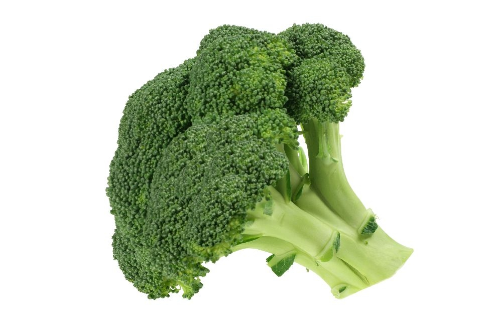

# TEAM 
* Marcin Majborski - Majbor1 - 1, 6
* Kacper Kwaśniewski - kwasniewski27 - 4, 5
* Kajetan Kuszlik - KajTan4 - 2, 3

# WPROWADZENIE 
>*Owoce* - jadalne części drzew lub krzewów będące z punktu widzenia morfologii roślin owocami lub owocostanami. Rośliny uprawne, z których się je uzyskuje nazywane są drzewami i krzewami owocowymi. Ich uprawą zajmuje się sadownictwo (dział ogrodnictwa). Uprawiane są w sadach, ogrodach i na plantacjach, rzadziej pozyskiwane są ze stanowisk naturalnych (z lasów).

>*Warzywa* - rośliny jednoroczne, dwuletnie lub byliny, które w całości lub w części stanowią pokarm człowieka. Mogą być spożywane w stanie surowym lub po obróbce cieplnej. Częściami użytkowymi roślin warzywnych mogą być całe rośliny lub tylko: liście, owoce, kwiatostany, bulwy, łodygi i korzenie.

>*Napoje* - płyn przeznaczony do konsumpcji przez człowieka. Napoje oprócz swojej podstawowej funkcji, jaką jest zaspokojenie pragnienia oraz dostarczanie pijącemu wartości odżywczych, mogą pełnić między innymi funkcje lecznicze, obyczajowe i obrzędowe (np. podczas zaślubin czy liturgii). 

# DANE 
Tabelka poniżej zawiera informacje o jedzeniu i napojach. Tabela pokazuje 

| Nazwa | Rodzaj | Kraj produkcji | Kolor |
|:-----:|:------:|:--------------:|:-----:|
| Borówka | Owoc | USA | Niebieski |
| Truskawka | Owoc | Europa | Czerwony |
| Coca-Cola | Napój | USA | Czarny |
| Ryż | Zboże | Azja | Biały |

# OBRAZY

